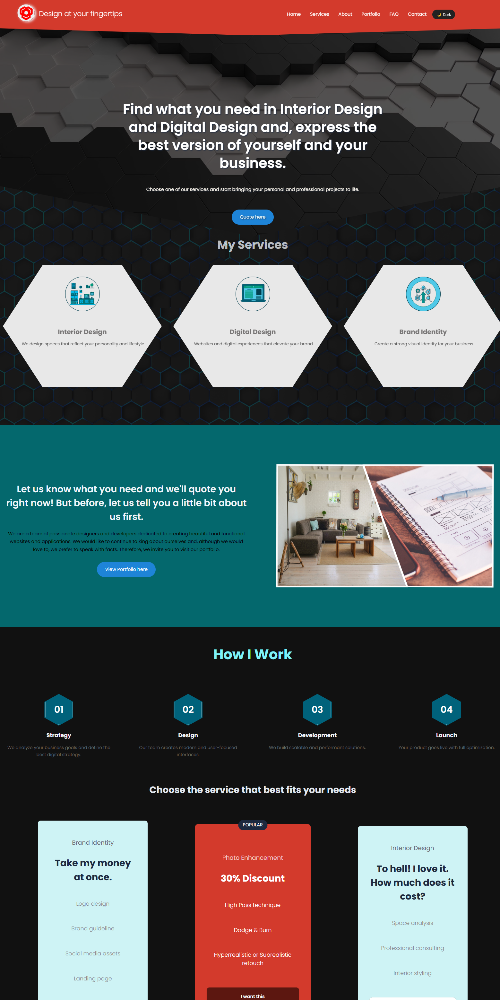

# Hexagon Design Landing Page

Modern landing page built with **React + Vite** focused on performance, minimal design, and smooth scroll interactions.

This project was created as part of my **Frontend Developer portfolio** to practice component architecture, animations without libraries, and modern UI patterns.

## Preview



## 🚀 Live Features

* Hero section with **video background**
* Hexagon themed design
* Services section with **hexagon cards**
* Scroll reveal animations using **Intersection Observer**
* Background transition between sections
* Responsive layout with **CSS Grid**

## 🛠 Tech Stack

* React
* Vite
* JavaScript (ES6+)
* CSS3
* Intersection Observer API

## 📂 Project Structure

```
src
 ├── components
 │    ├── Hero
 │    ├── Services
 │    └── About
 │
 ├── assets
 │    ├── images
 │    └── video
 │
 ├── styles
 │
 └── App.jsx
```

💼 Portfolio Landing Page

👷‍♂️ Built with:
- React
- CSS
- Framer Motion
- Responsive Grid
- Portfolio filtering
- Modal preview
- Lazy loading images

🧱 Features:
- Responsive design
- Animated sections
- Portfolio filtering by category
- Project modal preview
- Smooth hover animations

## ⚙️ Installation

Clone the repository

```
git clone https://github.com/your-username/your-repo-name.git
```

Install dependencies

```
npm install
```

Run the development server

```
npm run dev
```

## 🎯 Learning Goals

This project focuses on improving:

* Component-based architecture in React
* UI animations without external libraries
* Clean and scalable CSS structure
* Scroll-based interactions
* Performance-first frontend development

## 📌 Future Improvements

* Dark mode
* Stagger animations for cards
* Process / How we work section
* Portfolio gallery
* Contact form with validation

## 🔙🔚 Built a full-stack contact system with automated email responses and database persistence using Node.js, Express, Nodemailer, and Supabase.

## 👨‍💻 Author

Jean Piero Parra
Frontend Developer in training

