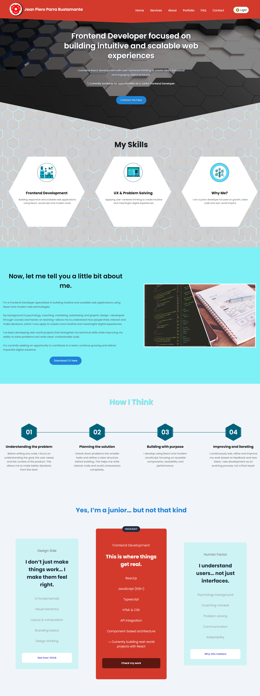

---

## 🚀 Live Demo
https://hexagon-desingne-landing-page-proje.vercel.app

---

# Hexagon Design Landing Page

Modern and responsive landing page built with **React + Vite**, focused on clean UI, smooth interactions, and performance-first frontend development.

This project evolved into a **full-stack portfolio project**, including a custom backend for contact form handling, automated email responses, and database persistence.

## Preview



## ✨ Features

### Frontend
* Responsive modern landing page
* Hero section with video background
* Hexagon-inspired UI design
* Smooth scroll interactions
* Scroll reveal animations using Intersection Observer API
* Dynamic background transitions between sections
* Responsive layouts with CSS Grid & Flexbox
* Clean component-based architecture

### Backend (🚧 Still under construction 🏗)
* Contact form connected to a custom API
* Automated email responses with Nodemailer and EmailJs
* Message persistence using Supabase
* Express server with modular routes
* Secure environment variable handling
* Error handling and backend validation

## 🛠 Tech Stack

### Frontend

* React
* Vite
* JavaScript (ES6+)
* CSS3
* Intersection Observer API

### Backend

* Node.js
* Express.js
* Nodemailer
* Brevo SMTP
* EmailJs
* Supabase
* Dotenv
* CORS

## 📂 Project Structure

```
/hexagon-project
├── src
│    ├── components
│    │     └── CreativeLab/
│    │         ├── CreativeLab.jsx
│    │         ├── creativeLab.css
│    │         ├── sketch.js
│    │         ├── Agent.js
│    │         ├── Vector.js
│    │         ├── utils.js
│    │     ├── Contact-footer
│    │         ├── Contact.jsx
│    │         └── Footer.jsx
│    └── ...
│    ├── App.jsx
│    └── main.jsx
├── backend
│    ├── server.js
│    ├── Config
│    ├── Supabase.js
│    ├── Controllers
│    ├── .env
│    └── ...
├── package.json

```

💼 Portfolio Landing Page

👷‍♂️ Built with:
- React
- CSS
- Framer Motion
- Responsive Grid
- Portfolio filtering
- Modal preview
- Lazy loading images

🧱 Features:
- Responsive design
- Animated sections
- Portfolio filtering by category
- Project modal preview
- Smooth hover animations

## ⚙️ Installation

Clone the repository

```
git clone https://github.com/your-username/hexagon-design-landing-page.git
```

Install dependencies

```
pnpm install
```

Run the frontend

```
pnpm run dev
```

🔧 Backend Setup

Create a .env file inside the backend folder:

Run the backend server:

```
npm run server
```


## 🎯 Learning Goals

This project focuses on improving:

* Component-based architecture in React
* Responsive UI development
* Backend integration with frontend applications
* REST API creation with Express.js
* Email automation workflows
* Database persistence with Supabase
* Scroll-based interactions and animations
* Clean and scalable code structure
* Deployment workflows with Vercel & Render

## 📌 Future Improvements

* Dark mode
* Form validation improvements
* Loading states and toast notifications
* Accessibility optimization
* Portfolio/projects gallery
* CMS integration
* Unit and integration testing
* Docker support

## 🚀 Deployment
Frontend

Deployed on:
[Vercel](https://hexagon-desingne-landing-page-proje.vercel.app)

Backend

Deployed on:
[Render](https://hexagon-desingne-landing-page-project.onrender.com)


## 🔙🔚 Built a full-stack contact system with automated email responses and database persistence using Node.js, Express, Nodemailer, and Supabase.

## 👨‍💻 Author

Jean Piero Parra <br/>
Frontend Developer | React Developer

📄 License

This project is open source and available under the MIT License.
